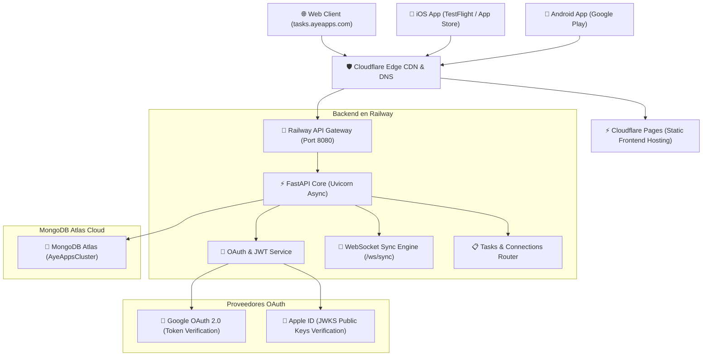

# 🌐 AyeTasks — Sistema y Arquitectura en la Nube

**AyeTasks** es una suite de productividad visual, gestión de tareas en grafo neuronal y temporizador de enfoque (Pomodoro), construida con arquitectura **Offline-First**, sincronización en tiempo real y despliegue multi-plataforma en la nube.

---

## 🏛️ Topología de Infraestructura



---

## 🔗 Enlaces y Dominios Oficiales de Producción

| Servicio | URL Pública / Protocolo | Proveedor / Host | Propósito |
| :--- | :--- | :--- | :--- |
| **Frontend Web** | [`https://tasks.ayeapps.com`](https://tasks.ayeapps.com) | Cloudflare Pages | Aplicación Web (SPA/PWA) |
| **Backend REST API** | [`https://api-aytsks.ayeapps.com/api/v1`](https://api-aytsks.ayeapps.com/api/v1) | Railway + Cloudflare | Endpoints CRUD & Autenticación |
| **WebSockets en Vivo** | `wss://api-aytsks.ayeapps.com/api/v1/ws/sync` | Railway + Cloudflare | Replicación y sincronización en tiempo real |
| **Base de Datos** | `mongodb+srv://...` | MongoDB Atlas (AWS) | Persistencia y réplicas primarias |
| **App iOS** | `com.ayeapps.ayetasks` | App Store Connect | Distribución nativa iPhone / iPad |
| **App Android** | `com.ayeapps.ayetasks` | Google Play Console | Distribución nativa Android |

---

## 🔐 Arquitectura de Autenticación y Seguridad

AyeTasks cuenta con un sistema de autenticación unificado y redundante:

### 1. Google Sign-In (Multiplataforma)
- **Web Client ID:** `627799707976-gt9uudejrtd5d4b7pubkso0ev35j2rhr.apps.googleusercontent.com`
- **iOS Client ID:** `627799707976-dmm76mhsvc1b7d7jcrf2hpfjbtnpb6te.apps.googleusercontent.com`
- **Android Client ID:** `627799707976-ek7dcu7lgfuj06us18cu5gnfuf6n3qqt.apps.googleusercontent.com`
- **Validación:** El backend valida criptográficamente el `id_token` con la librería oficial `google-auth` contra los Client IDs autorizados.

### 2. Apple Sign-In (Cross-Platform)
- **iOS:** Autenticación nativa biométrica vía `expo-apple-authentication` con `com.apple.developer.applesignin`.
- **Android y Web:** Flujo OAuth 2.0 Web vía Services ID `com.ayeapps.ayetasks.auth` con redirección segura por backend callback:
  `POST https://api-aytsks.ayeapps.com/api/v1/auth/oauth/apple/callback`
- **Validación:** El backend descarga y verifica las firmas de las llaves públicas oficiales de Apple (`https://appleid.apple.com/auth/keys`).

### 3. Autenticación Local y Rotación de Tokens
- **Algoritmo:** JWT (HMAC-SHA256).
- **Access Token:** 60 minutos de vida.
- **Refresh Token:** 30 días de vida con rotación en cada llamada e invalidación de token previo vía colección `revoked_tokens` (`jti`).
- **Borrado de Cuenta:** Endpoint seguro `DELETE /api/v1/auth/me` que revoca tokens y purga en cascada tareas, conexiones, recordatorios y registros de tiempo.

---

## 🔄 Motor de Sincronización en Tiempo Real & Offline-First

1. **Estado Local Inmediato:** Las operaciones del usuario (crear tareas, mover nodos, pausar timer) impactan la UI y el almacenamiento local sin latencia perceptual.
2. **Cola de Sincronización:** Si se pierde la conexión a internet, las mutaciones se encolan con marcas de tiempo ISO UTC.
3. **WebSockets Bidireccionales:** Al restaurar conexión, el cliente se conecta a `wss://api-aytsks.ayeapps.com/api/v1/ws/sync` y replica todos los cambios a los demás dispositivos conectados del usuario.

---

## 💻 Entorno y Variables de Configuración

### Frontend ([`.env`](file:///.env))
```env
EXPO_PUBLIC_API_URL=https://api-aytsks.ayeapps.com/api/v1
EXPO_PUBLIC_WS_URL=wss://api-aytsks.ayeapps.com/api/v1/ws/sync
EXPO_PUBLIC_GOOGLE_WEB_CLIENT_ID=627799707976-gt9uudejrtd5d4b7pubkso0ev35j2rhr.apps.googleusercontent.com
EXPO_PUBLIC_GOOGLE_IOS_CLIENT_ID=627799707976-dmm76mhsvc1b7d7jcrf2hpfjbtnpb6te.apps.googleusercontent.com
EXPO_PUBLIC_GOOGLE_ANDROID_CLIENT_ID=627799707976-ek7dcu7lgfuj06us18cu5gnfuf6n3qqt.apps.googleusercontent.com
EXPO_PUBLIC_APPLE_SERVICE_ID=com.ayeapps.ayetasks.auth
```

### Backend (Variables en Railway)
```env
APP_NAME=AyeTasks
APP_ENV=production
PORT=8080
MONGODB_URL=mongodb+srv://ayeapps_railway_ayetasks:<PASSWORD>@ayeappscluster.thvrrki.mongodb.net/ayetasks?retryWrites=true&w=majority&appName=AyeAppsCluster
JWT_SECRET_KEY=<SECRET_KEY_MIN_32_CHARS>
JWT_ALGORITHM=HS256
ACCESS_TOKEN_EXPIRE_MINUTES=60
REFRESH_TOKEN_EXPIRE_DAYS=30
CORS_ORIGINS=*
```

---

## 🛠️ Comandos de Desarrollo y Compilación

### Frontend Web & Local
```bash
# Desarrollo local
npm start

# Exportar versión web estática para producción (Cloudflare Pages)
npx expo export --platform web

# Ejecutar cliente nativo en Android
npx expo run:android

# Ejecutar cliente nativo en iOS
npx expo run:ios
```

### Backend (Docker Local)
```bash
cd backend

# Iniciar contenedor backend y MongoDB local
docker compose up -d

# Ejecutar suite de pruebas de autenticación y lógica
docker compose exec -e PYTHONPATH=. backend pytest
```

---

## 📦 Flujo de Despliegue Continuo (CI/CD)

- **Frontend (Cloudflare Pages):** Cada push a la rama `main` compila y publica automáticamente la versión web en `tasks.ayeapps.com`.
- **Backend (Railway):** Cada push a la rama `main` compila la imagen Docker en la nube y reinicia el servicio con cero tiempo de inactividad (*zero-downtime rolling restart*).
- **iOS (App Store Connect / TestFlight):** Compilado y firmado mediante Xcode (`ios/AyeTasks.xcworkspace`) o EAS Build.
