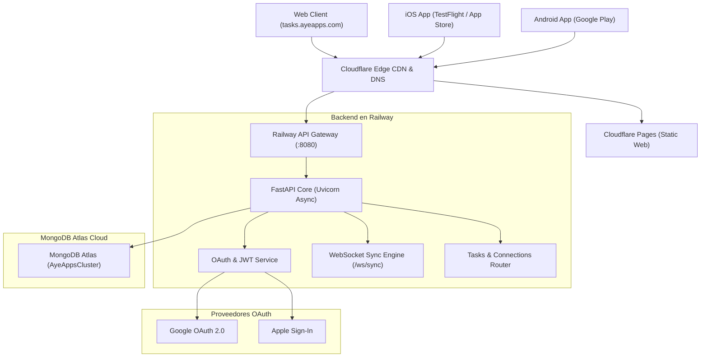

# AyeTasks — Neural Graph Productivity & Focus Suite


**AyeTasks** es una suite de productividad visual, gestión de tareas en grafo neuronal y temporizador de enfoque (Pomodoro), construida con arquitectura **Offline-First**, sincronización bidireccional en tiempo real vía WebSockets y un único codebase multiplataforma para Web, iOS y Android.

---

## Por qué este Stack

- **React Native + Expo (CNG SDK 57):** Elimina la duplicación de código entre Web, iOS y Android. Con Continuous Native Generation (CNG), el código de interfaz en `App.tsx` y `src/` se ejecuta en navegadores web de escritorio y se compila de forma nativa en Swift (iOS) y Kotlin (Android).
- **Arquitectura Offline-First con Zustand:** Toda interacción (crear nodos, vincular tareas, iniciar timers) se almacena y procesa localmente en milisegundos sin bloquear la interfaz esperando respuestas de red.
- **WebSockets Bidireccionales (`/ws/sync`):** Motor de sincronización en tiempo real sobre FastAPI. Cuando un dispositivo reconecta o muta un grafo, los deltas se propagan instantáneamente al resto de sesiones activas del usuario.
- **MongoDB Atlas + Motor Async:** Estructura flexible de documentos para modelar grafos neuronales de tareas, dependencias entre nodos, coordenadas 2D y registros de Pomodoro.

---

## Topología de Infraestructura



---

## Estructura del Repositorio

```
ayetasks/
├── backend/                  # API REST + WebSockets (FastAPI + Motor)
│   ├── app/
│   │   ├── api/v1/           # Endpoints (auth, tasks, connections, pomodoro, websockets)
│   │   ├── core/             # Configuración, deps, JWT, rate limiter
│   │   ├── db/               # Conector MongoDB
│   │   ├── models/           # Task, Connection, PomodoroSession
│   │   └── services/         # Sync engine, diff resolver
│   ├── Dockerfile            # Imagen contenedor de backend
│   └── main.py               # Entrypoint FastAPI
├── mobile/                   # Cliente unificado Web, iOS & Android
│   ├── src/
│   │   ├── components/       # GraphCanvas, TaskNode, PomodoroTimer, AuthScreen
│   │   ├── hooks/            # useSync, useWebSocket, useGraph
│   │   ├── store/            # Estado global reactivo con Zustand
│   │   └── theme.ts          # Tokens de diseño Atelier
│   ├── app.json              # Configuración Expo CNG (com.ayeapps.ayetasks)
│   ├── build.sh              # Script maestro de compilación (Android/iOS)
│   └── package.json          # Dependencias cliente
├── docker-compose.yml        # Entorno local multi-contenedor
└── DEVELOPMENT_GUIDE.md      # Guía detallada para Xcode y Android Studio
```

---

## Variables de Entorno

### Cliente (`mobile/.env`)
```env
EXPO_PUBLIC_API_URL=https://api-aytsks.ayeapps.com/api/v1
EXPO_PUBLIC_WS_URL=wss://api-aytsks.ayeapps.com/api/v1/ws/sync
EXPO_PUBLIC_GOOGLE_WEB_CLIENT_ID=627799707976-gt9uudejrtd5d4b7pubkso0ev35j2rhr.apps.googleusercontent.com
EXPO_PUBLIC_GOOGLE_IOS_CLIENT_ID=627799707976-dmm76mhsvc1b7d7jcrf2hpfjbtnpb6te.apps.googleusercontent.com
EXPO_PUBLIC_GOOGLE_ANDROID_CLIENT_ID=627799707976-ek7dcu7lgfuj06us18cu5gnfuf6n3qqt.apps.googleusercontent.com
EXPO_PUBLIC_APPLE_SERVICE_ID=com.ayeapps.ayetasks.auth
```

### Backend (`backend/.env`)
```env
APP_NAME=AyeTasks
APP_ENV=production
PORT=8080
MONGODB_URL=mongodb+srv://.../ayetasks
JWT_SECRET_KEY=clave_segura_minimo_32_caracteres
JWT_ALGORITHM=HS256
ACCESS_TOKEN_EXPIRE_MINUTES=60
REFRESH_TOKEN_EXPIRE_DAYS=30
CORS_ORIGINS=*
```

---

## Inicio Rápido

### 1. Cliente (Web & Desarrollo Móvil)
```bash
cd mobile
npm install

# Iniciar servidor Metro (Web / Emuladores)
npm start

# Compilar directamente para Android (requiere Android SDK)
./build.sh run-android

# Compilar directamente para iOS (requiere macOS + Xcode)
./build.sh run-ios

# Exportar bundle Web de producción
npx expo export --platform web
```

### 2. Backend (FastAPI Local)
```bash
cd backend
python3 -m venv venv
source venv/bin/activate
pip install -r requirements.txt

uvicorn main:app --reload --port 8080
```

### 3. Ejecución con Docker Compose
```bash
cd backend
docker compose up -d
```

---

## Flujo de Despliegue Continuo (CI/CD)

- **Frontend Web (Cloudflare Pages):** Cada push a `main` compila y despliega estáticamente en [`tasks.ayeapps.com`](https://tasks.ayeapps.com).
- **Backend (Railway):** Despliegue automatizado de contenedor Docker con rolling restart sin tiempo de inactividad.
- **Móvil (App Store & Play Store):** Builds firmados generados mediante `./build.sh` o EAS Build.
